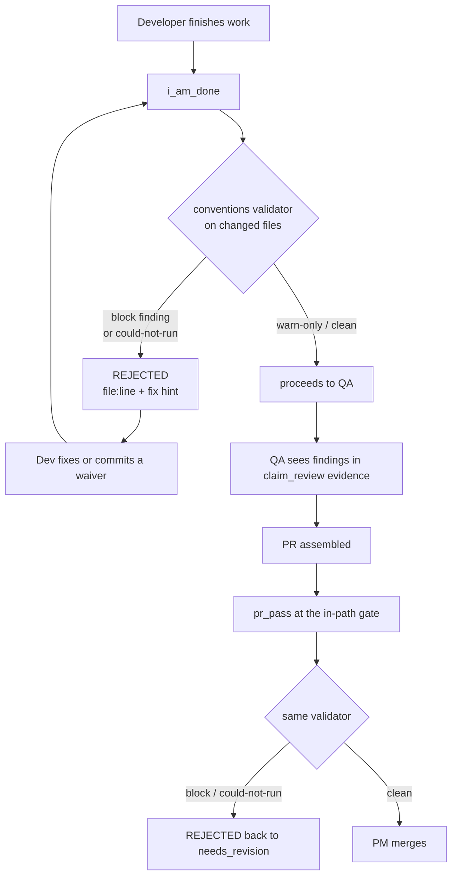

# Architectural Conventions Standard

The `make`-style gates you configure per project (ruff, mypy, eslint, your test suite) answer one question: *is the code valid?* They cannot answer a second one a senior reviewer would catch on sight: *does this code live where it belongs?* The Architectural Conventions Standard is RoboCo's answer to that second question. It gives each project a repo-canonical architecture map and a tree-sitter validator that **hard-gates** an agent from landing a model defined inside a router, a route handler that runs its own SQL, a React component that fetches its own data, or a `# noqa` / `# type: ignore` that quietly silences the linter.

It is **off by default** behind `ROBOCO_CONVENTIONS_ENABLED`. Every hook — the auto-scaffold, the prompt injection, the per-task constraints, and the gates — is fully inert until you turn it on.

## What it does

When enabled, the standard reaches the work in two directions. It *guides* agents up front — an "Architectural Standard" block is injected into every agent's prompt at spawn, and a `## Constraints` section listing the project's block-level rules and module boundaries is auto-attached to every task. And it *enforces* the same rules at the gate — a `block`-level finding refuses `i_am_done` (the developer's pre-submit) and `pr_pass` (the [in-path PR gate](pr-review.md)) with the offending `file:line` and a fix hint, while QA sees the findings in its review evidence.

The rules live in a per-project `.roboco/conventions.yml` with four curated parts plus a set of structural checks:

| Part | What it is |
|------|-----------|
| **Module map** | Path prefixes mapped to a human purpose and the definition *kinds* forbidden there (`model`, `route`, `helper`, `business_logic`, `component`). "`routers/` is for HTTP routes — no models, no helpers." |
| **Rules** | A toggleable rule set. Each rule fires at `warn` (advisory, never blocks) or `block` (refuses the gate). |
| **Custom rules** | Project-specific regex rules — a pattern, a message, and a level, optionally scoped to languages. |
| **Waivers** | Accountable per-`(path, rule)` escape hatches with a written reason — the sanctioned way to relieve a false positive, reviewed in the PR. |

### Placement, hygiene, and modularity checks

The validator runs four check families over each changed file:

- **Placement** — a definition whose *kind* is forbidden in its module (a model in a router).
- **Hygiene** — the universal, stack-agnostic house-style rules seeded into every project: `no_lint_suppressions` (`block` by default — no `# noqa`, `# type: ignore`, `eslint-disable`) and `no_inline_comments` (`warn`).
- **Custom** — your project-specific regex rules.
- **Modularity** — separation-of-concerns judgements the linters are blind to, inspecting a file's *composition* and a definition's *body*, not just its top-level kind:

| Rule | Fires when | Default level |
|------|-----------|---------------|
| `modular_cohesion` | One file mixes architectural concerns (e.g. a model *and* a route *and* a component) | `block` |
| `thin_routes` | A route handler does its own data access (SQLAlchemy `execute`/`commit`/`select`…) instead of delegating to a service | `block` |
| `thin_components` | A React component fetches data in its body instead of through a hook | `block` |
| `god_class` | A class grows past 15 methods (single-responsibility smell) | `warn` |

!!! info "Precision over recall"
    Every check fires only on a confident, structural signal, and abstains when it is uncertain — so a `block`-level gate is never tripped by a guess. If the validator genuinely *cannot* run on a diff (a parse or grammar error), it is **fail-loud**: it exits non-zero and the gate blocks rather than passing silently.

## The effective map: defaults, present, absent, or partial

Consumers never read the raw committed file — they read the **effective map**, so behaviour is identical whether `.roboco/conventions.yml` is present, absent, or partial. `ConventionsService` (`roboco/services/conventions.py`) builds it by auto-deriving a baseline from a repo scan (it infers modules from directory names like `routers/`, `models/`, `services/`, `components/`, `hooks/`; detects languages by file extension; seeds the universal hygiene rules) and then overlaying the committed file on top. The result is cached per `(project, HEAD sha)`.

That is the load-bearing property: **the standard is enforced even before any file is committed.** A project with no `.roboco/conventions.yml` still gets sensible auto-derived rules and is gated by them. Resilience is built in — a missing file degrades to the auto-derived defaults, and an unparseable file falls back to the last-good cached map (status `degraded`) so the standard is never silently switched off by a typo.

## The per-project Conventions editor

Each project carries a **Conventions** tab in its edit dialog (panel component `panel/src/components/conventions/conventions-tab.tsx`). From there you manage the whole standard without hand-editing YAML:

- **Module boundaries** — add/remove modules, set each one's path and purpose, and click a kind badge (`no model`, `no route`, `no helper`, `no business_logic`, `no component`) to toggle whether it is forbidden there.
- **Rules** — flip each rule between `warn` and `block` with a switch.
- **Custom rules** — add a regex `id`/pattern/message and set its level.
- **Waivers** — exempt a file from a rule with a written reason.
- **Recent violations** — the latest findings recorded across this project's tasks, each tagged with its rule and level.

Two state banners keep you honest about what is in force:

!!! note "Using auto-derived defaults"
    When no file is committed yet, the tab shows a neutral **"Using auto-derived defaults"** banner — *not* an error. These rules are already enforced. The Save button reads **"Save defaults to repo"**: one click backfills the canonical file. (The earlier read-only, "missing"-as-broken behaviour is gone — this is the full editor with one-click backfill.)

!!! warning "Conventions degraded"
    If a committed file won't parse, an amber **"Conventions degraded"** banner appears. The effective map has fallen back to the last-good cache plus defaults; **Restore from last-good** re-commits the previous working file.

### Save and Restore open a PR

The standard is repo-canonical, so the editor never edits files behind your back. **Save to repo** and **Restore from last-good** each open a pull request against the project (via `GitService.open_conventions_pr`) carrying the new `.roboco/conventions.yml`. You review and merge it like any other change. If the project's workspace isn't cloned yet, the change is prepared on the branch and the toast tells you no remote PR was opened.

## How agents are hard-gated



Enforcement is deterministic and lives at two gateway choke points (`roboco/services/gateway/choreographer/`):

- **`i_am_done`** — the developer's pre-submit. A `block`-level finding refuses the verb with the offending `file:line` and a fix hint; the findings are also persisted to the project's violations feed (even the ones that blocked).
- **`pr_pass`** — the [in-path PR-review gate](pr-review.md). The same validator runs on the assembled PR's changed files; a `block` finding fails it back to `needs_revision`.
- **QA evidence** — when QA calls `claim_review`, the convention findings ride along in its review briefing so the human-style review sees them too.

A false positive is relieved one way only: the developer commits a **waiver** in their branch — an accountable `(path, rule, reason)` entry reviewed in the PR — never a silent in-code `# noqa`.

## Enable it

You can turn the standard on two ways; the effect is the same.

=== "Panel"

    Open **Settings → Feature Flags** and toggle **"Enforce a per-project architectural standard"** on.

    !!! note "Takes effect on the next backend restart"
        A feature-flag toggle persists in the settings store and is applied on the **next backend restart** — it is not a hot reload. Flip it, then restart the orchestrator.

=== "Environment"

    Set the flag in your compose/env and restart:

    ```bash
    ROBOCO_CONVENTIONS_ENABLED=true
    ```

An unset flag falls back to its config default (off). See the [environment reference](../deploy/env-reference.md) for the full flag list.

## What changes when it's on

- Every agent's prompt carries the project's "Architectural Standard" block, and every project task gets an auto-attached `## Constraints` section.
- `i_am_done` and `pr_pass` block on `block`-level findings; QA sees findings in its review evidence.
- The project's **Conventions** tab is live — view the effective map and health, edit it, and Save/Restore via a PR.
- The validator CLI (`python -m roboco.conventions check --root <repo> --files …`) runs inside the agent image (the Python and TypeScript tree-sitter grammars are shipped there).

When the flag is off, none of the above happens — no prompt block, no constraints, no gating, no scaffold.

## Next

→ [Toolchain matching](toolchain-matching.md) closes a different hollow-pass hole · [The in-path PR gate](pr-review.md) is where `pr_pass` runs · back to [Optional subsystems](index.md).
