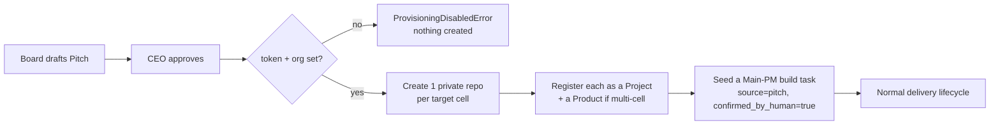

# Pitch Auto-Provisioning

Your Board can propose new products, not just deliver the ones you hand it. A **Pitch** (title, problem, proposed solution, target cells) is drafted by the Product Owner or Head of Marketing and lands in **Business → Pitches** for your decision. When you approve a pitch and provisioning is configured, RoboCo turns that approval into real infrastructure: one private GitHub repo per target cell, registered as Projects, with a Main-PM build task seeded into the normal delivery lifecycle. This is the only place in the whole system that *creates* GitHub repos — everywhere else clones, branches, and opens PRs against repos that already exist.

## Default state

The master switch `ROBOCO_PROVISIONING_ENABLED` defaults to `true`, but the capability is **inert unless a token and an org are both set**. With no `ROBOCO_PROVISIONING_TOKEN` and no `ROBOCO_PROVISIONING_ORG`, approving a pitch raises `ProvisioningDisabledError` and creates nothing. So out of the box, pitch approval is a no-op until you point it at a GitHub org. The Settings → Feature Flags card exposes the toggle ("Auto-provision projects from approved pitches"), but the toggle alone does nothing without the credentials.

## Enable it

1. **Create a GitHub PAT** with `repo` + org-admin scope, in the org you want repos created in.
2. **Set the credentials** in your deploy environment:

   | Env var | Default | Purpose |
   |---------|---------|---------|
   | `ROBOCO_PROVISIONING_ENABLED` | `true` | Master switch. Inert regardless unless token + org are also set. |
   | `ROBOCO_PROVISIONING_TOKEN` | (empty) | GitHub PAT used to create repos. Needs `repo` + org-admin scope. **Server-side only.** |
   | `ROBOCO_PROVISIONING_ORG` | (empty) | GitHub organization where new repos are created. |
   | `ROBOCO_PROVISIONING_REPO_PRIVATE` | `true` | Whether provisioned repos are created private. |
   | `ROBOCO_GITHUB_API_BASE_URL` | `https://api.github.com` | REST API base — override for GitHub Enterprise. |
   | `ROBOCO_PROVISIONING_TIMEOUT_SECONDS` | `30.0` | Per-request timeout for GitHub provisioning calls. |

3. Confirm the **Settings → Feature Flags** toggle is on (it falls back to the config default if unset).
4. **Restart the backend.**

The token and org live only in server-side config — like the research key, they are never injected into an agent container.

## What changes when it's on

When you approve a pitch in **Business → Pitches**, `PitchService` runs the provisioning sequence:

A single-cell pitch produces one repo named after the slug; a multi-cell pitch produces one repo per cell (`{slug}-{cell}`) and a **Product** mapping each cell to its repo, which is what drives the Main-PM integration-branch model. The seeded task is a real PENDING task assigned to the Main PM and flows through the same lifecycle as any other work.

## The partial-failure caveat

!!! warning "A failed approval can leave orphan repos"
    GitHub repo creation is an un-rollback-able side effect. If provisioning fails partway — say it creates the first cell's repo and then errors on the second — the database writes roll back (the approval route does not commit), but **the repos already created on GitHub remain**. A re-approval will then collide on the repo name and fail. You resolve this manually: delete or rename the orphaned repo(s) on GitHub, or finish wiring them up by hand, before re-approving. RoboCo deliberately does not auto-delete repos it created, so it can never destroy work.

## Required extra config

A GitHub PAT (`repo` + org-admin scope) and the target org are mandatory — there is no provisioning without them. For GitHub Enterprise, also set `ROBOCO_GITHUB_API_BASE_URL`. Provisioning writes Project / Product / task rows, so make sure your migrations are current (`alembic upgrade head`).

## Next

→ **[Projects and products](../panel/projects-and-products.md)** — what a Project and a multi-cell Product are. → **[The merge model](../company/merge-model.md)** — how the Main PM cuts one integration branch per repo. → **[The business workflow](../how-to/05-the-business-workflow.md)** — drafting and reviewing pitches.
