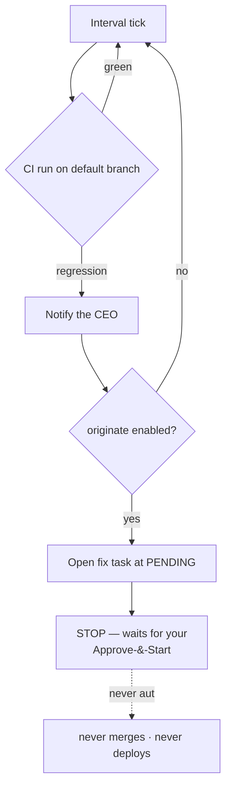

# Self-healing CI loop

RoboCo can watch its **own** repository's CI and heal itself: when its CI regresses, it notifies you, and — behind a second opt-in — queues a fix task into its own delivery lifecycle. It never starts that task, never merges it, and never deploys. Every downstream step stays a human decision.

The loop is **dormant by default**. Nothing runs and no GitHub call is made until you arm it (`roboco/services/self_heal_engine.py`).

## What it does

On an interval (`ROBOCO_SELF_HEAL_INTERVAL_SECONDS`, default 1800s) the engine assesses the latest completed CI run on the target repo's default branch. On a detected regression — a failing run — it sends you an **acknowledgement notification** as the CEO. That is the entire behaviour of the first opt-in: **detect and notify**.

With the second opt-in also on, a regression *additionally* opens a fix task into the regressed project's lifecycle — created at **`PENDING`** and held out of dispatch — and stops. It is layered so the loop can never run away with the backlog:



!!! danger "It never merges or deploys"
    The loop terminates at a human gate. An originated fix task sits at `PENDING`; once you Approve-&-Start it, it flows through the normal delivery lifecycle and ultimately escalates to `awaiting_ceo_approval` for your sign-off — exactly like any other task. The loop never approves, merges, or deploys on its own.

### Bounds on origination

Origination is capped so a flapping CI can't flood the backlog:

| Setting | Default | Meaning |
|---------|---------|---------|
| `ROBOCO_SELF_HEAL_MAX_PER_CYCLE` | `1` | Most fix tasks the loop may open in one cycle. |
| `ROBOCO_SELF_HEAL_MAX_OPEN_TASKS` | `3` | Rolling cap on concurrently-open self-heal tasks; the loop originates nothing more while this many are still open. |

## Required configuration

The loop watches exactly **one** project — RoboCo itself — and you must name it:

| Setting | Required? | Notes |
|---------|-----------|-------|
| `ROBOCO_SELF_HEAL_ENABLED` | yes (first opt-in) | Master switch: detect + notify. Off ⇒ the loop never runs, no CI telemetry is fetched. |
| `ROBOCO_SELF_HEAL_PROJECT_SLUG` | **yes** | The registered project slug that *is* RoboCo. Empty ⇒ the loop no-ops even when enabled. |
| `ROBOCO_SELF_HEAL_ORIGINATE_ENABLED` | yes (second opt-in) | Adds task origination on top of notify. Off ⇒ notify-only. |
| `ROBOCO_SELF_HEAL_CI_WORKFLOW` | no (default `ci.yml`) | Scopes the CI signal to one workflow file. |

!!! warning "Set the CI workflow on a multi-workflow repo"
    `ROBOCO_SELF_HEAL_CI_WORKFLOW` defaults to `ci.yml`. Leave it empty *only* on a single-workflow repo — an empty value reads the latest completed run across **all** workflows on the default branch, which lets an unrelated green run mask a red CI run and makes the signal flicker.

## Enable it

=== "Panel"

    **Settings → Feature Flags** exposes both switches: **"Watch RoboCo's own CI and notify you when it regresses"** and the originate opt-in. Toggle the first to go notify-only, both to enable origination.

    !!! note "Takes effect on the next backend restart"
        Feature-flag toggles persist in the settings store and apply on the **next backend restart**. The project slug and CI workflow are environment settings, not flags — set them in env.

=== "Environment"

    ```bash
    ROBOCO_SELF_HEAL_ENABLED=true
    ROBOCO_SELF_HEAL_PROJECT_SLUG=roboco          # the project that IS RoboCo
    ROBOCO_SELF_HEAL_ORIGINATE_ENABLED=true       # optional second opt-in
    # ROBOCO_SELF_HEAL_CI_WORKFLOW=ci.yml         # default; set empty only if single-workflow
    ```

See the [environment reference](../deploy/env-reference.md) for the full list.

## What changes when it's on

- A background loop polls the target repo's CI on the configured interval; with both opt-ins off, nothing polls.
- On a regression you receive an acknowledgement notification as the CEO.
- With originate on, a `PENDING` fix task appears in the backlog (bounded by the caps above), held for your Approve-&-Start — it never auto-runs.

## Next

→ [Health & metrics](../operations/health-and-metrics.md) for the CI/regression signal · [Task lifecycle](../company/task-lifecycle.md) for what an originated task does once you start it · back to [Optional subsystems](index.md).
