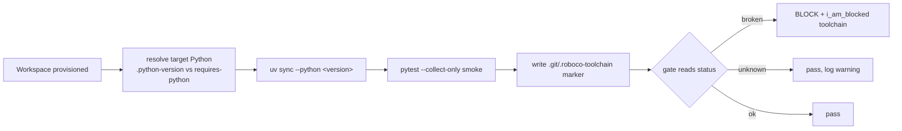

# Toolchain matching

The agent image bakes one Python (RoboCo's own stack). But the repositories your agents build declare their *own* Python requirement — a target pinned to 3.14 cannot be honestly verified by an agent running 3.13. When the interpreters don't match, the suite fails to even *collect*, and a QA or PR-review pass degrades into "I read the source and it looks fine" — a **hollow pass** on a suite that never actually ran. Toolchain matching closes that hole.

It is **off by default** in config (`ROBOCO_TOOLCHAIN_MATCH_ENABLED`). When off, workspace provisioning behaves exactly as before, against the system interpreter.

## What it does

When enabled, two things happen.

**1. Provision against the target's declared Python.** When an agent's workspace is set up, RoboCo resolves the interpreter the *target* project needs and provisions the workspace's `.venv` with it (`uv sync --python <version>`). The resolver (`roboco/services/toolchain.py`) reads both `.python-version` and `pyproject.toml`'s `requires-python`, and applies one load-bearing rule:

!!! info "Why `.python-version` is not blindly trusted"
    uv lets a `.python-version` file override `requires-python` during interpreter selection — so a repo pinned to 3.13 whose packages actually need 3.14 silently gets the *wrong* interpreter. RoboCo therefore honours the `.python-version` pin **only when it satisfies `requires-python`**; otherwise it resolves a concrete version from `requires-python` and passes that to uv explicitly with `--python`, which overrides the pin. A target that declares nothing actionable leaves provisioning unchanged.

**2. Write a runnability marker, then gate on it.** After provisioning, RoboCo runs a runnability smoke (`pytest --collect-only`) under the chosen interpreter and records the outcome to a per-workspace marker (`.git/.roboco-toolchain`):

| Status | Meaning |
|--------|---------|
| `ok` | The suite collected cleanly (or there are no tests) — the interpreter can run it. |
| `broken` | A collection / import error — the interpreter-mismatch signature. |
| `unknown` | Inconclusive — provisioning ran but the smoke couldn't confirm the suite is collectable. |

The delivery gates (`i_am_done`, `pass_review`, `pr_pass`) then read that status:

- **`broken` blocks.** The verb is refused: *"the project's test suite cannot be executed in this workspace (interpreter mismatch) — verifying by reading source is hollow."* The remediation tells the agent to call `i_am_blocked(reason='toolchain')` so the environment is rebuilt against the right interpreter, rather than passing on a source read.
- **`unknown` does not strand the task.** It fails *open* (precision over recall — a guess must never block a healthy task) but **never silently**: the orchestrator logs a `toolchain.unverified_gate_pass` warning so you can see the gate proceeded past an unconfirmed toolchain.
- **`ok` (or no marker)** passes normally.



## Enable it

!!! tip "On in the personal compose"
    The config default is **off**, but this flag is turned **on** in the personal (non-registry) compose files. If you run from those, it is already active; the registry compose leaves it at the config default.

=== "Panel"

    **Settings → Feature Flags** → toggle the toolchain-match flag on.

    !!! note "Takes effect on the next backend restart"
        Feature-flag toggles persist in the settings store and apply on the **next backend restart**, not as a hot reload.

=== "Environment"

    ```bash
    ROBOCO_TOOLCHAIN_MATCH_ENABLED=true
    ```

See the [environment reference](../deploy/env-reference.md) for all flags.

## What changes when it's on

- New agent workspaces are provisioned against the *target* repo's declared Python instead of the image's system interpreter.
- Each workspace carries a `.git/.roboco-toolchain` marker recording its `(python, status)`.
- `i_am_done`, `pass_review`, and `pr_pass` block on a `broken` status, and log a visible warning on `unknown`.

When off, provisioning and the gates behave exactly as they did before — no resolution, no marker, no extra gating.

## Next

→ [Conventions](conventions.md) closes the *placement* hollow-pass hole · [The PR review gate](pr-review.md) is one of the gates this protects · back to [Optional subsystems](index.md).
