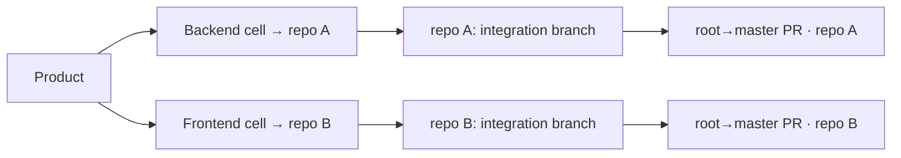

# Projects & Products

Two pages define *what* the company builds and *who* builds it. **Projects** (`/projects`) are the git repositories RoboCo is allowed to touch. **Products** (`/products`) group several repositories into one shipping unit and route each delivery cell to the repo it owns. You only need Products when a single thing you ship spans more than one cell.

## Projects

A project is one git repository plus the configuration that tells the company how to build and check it. The Projects page is where you register, search, and edit them.

- **New** opens the create dialog — name, slug, git URL, GitHub token, assigned cell, default branch, and optional per-project gate commands.
- The list supports **search**, a **cell filter**, and a **show-inactive** toggle so retired repos stay out of the way without being deleted.
- **Edit** reopens the same form to rotate the token, change the gate commands, or flip the assigned cell. The edit dialog also hosts the per-project **Conventions** tab — see [Architectural conventions](../optional/conventions.md) — and an **Autonomous Maintenance** section to opt the project into CI-watch (with an optional workflow file) and the dependency-update bot (its command and optional lockfile paths) — see [Autonomous maintenance](../optional/autonomous-maintenance.md).

The field-by-field detail — what each field means, the token scopes you need, the encryption guarantee, and the default-branch gotcha — lives in [Register your first project](../get-started/first-project.md). Read that page before you create a repo; this page doesn't repeat it.

!!! tip "Set the gate commands"
    The single biggest lever on output quality is pointing a project's `quality_command` and per-step commands at the *real* checks you'd run locally. The company then gates itself the way you would. Details in [Gate commands](../get-started/first-project.md#gate-commands).

## Products

A **product** maps each delivery cell to the project (repository) it builds for that product. Use it when one deliverable spans multiple cells — a Backend repo and a Frontend repo, say, that ship together.

The page is a straightforward table plus a **New** button. A product carries a name and a set of cell-to-project assignments: Backend → repo A, Frontend → repo B, UX/UI → repo C. A cell with no assignment simply doesn't participate in that product.

### Why the mapping matters

When the Main PM decomposes a product into work and fans it out to the cells, the branch and PR structure follows the mapping. **The Main PM cuts one integration branch per distinct repository in the product.** A cell's work lands on its repo's integration branch; the cell PM opens the cell→root PR within that repo, and the Main PM opens the root→master PR per repo. Two cells assigned the *same* repo share one integration branch; two cells on *different* repos get one each.

!!! note "Single-repo work needs no product"
    If everything you're shipping lives in one repo, you don't need a product at all — register the project and hand the Task Assistant or the Create Task dialog that project directly. Products exist purely to coordinate a multi-repo, multi-cell deliverable.

For how branches assemble and merge once the cells are building, see the [merge model](../company/merge-model.md). For the lifecycle a single task moves through, see the [task lifecycle](../company/task-lifecycle.md).

## Next

→ [Tasks & Kanban](./tasks-and-kanban.md) to author and track the work · [Git](./git.md) to watch the branches and PRs land.
